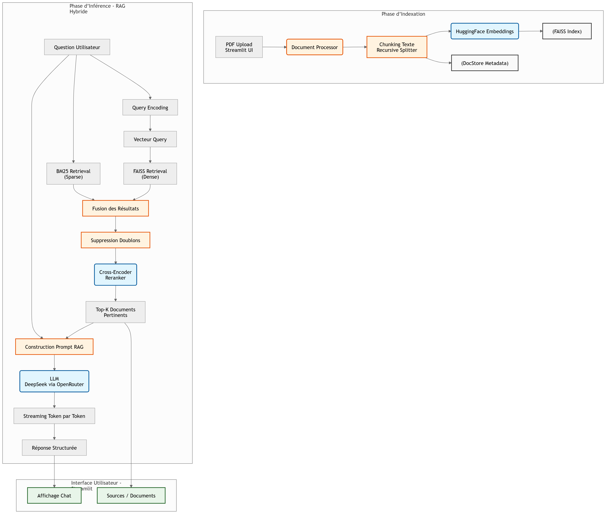

# Scientific Research RAG Assistant (Hybrid Retrieval + Reranker + Streaming)

Un assistant intelligent basé sur **Retrieval-Augmented Generation (RAG)** permettant d’analyser des articles scientifiques PDF et de répondre à des questions complexes avec des réponses structurées, sourcées et en temps réel.

## Fonctionnalités

### Gestion des documents

- Upload de plusieurs fichiers PDF simultanément
- Extraction automatique du texte
- Chunking intelligent des

title: Scientific RAG Research Agent
emoji:
colorFrom: blue
colorTo: purple
sdk: streamlit
sdk_version: 1.35.0
app_file: app.py
python_version: 3.10
pinned: false

## Scientific RAG Research Agent

[](https://opensource.org/licenses/MIT)
[](https://www.python.org/downloads/)
[](https://www.langchain.com/)

> **An advanced Retrieval-Augmented Generation (RAG) system designed for scientific document understanding, combining hybrid retrieval, neural reranking, and real-time streaming generation.**

## Project Overview

**Scientific-RAG-Agent** is an intelligent assistant specialized in analyzing **scientific articles (PDF)** and answering complex research questions with high precision.

The system combines:

- **Document understanding**
- **Hybrid retrieval (semantic + lexical)**
- **Neural reranking (Cross-Encoder)**
- **Real-time LLM streaming**

## Capabilities

- Explain scientific papers
- Extract methodologies and results
- Summarize multiple documents
- Answer complex research questions
- Reduce hallucinations via grounded responses

## Architecture

The system follows a **Hybrid RAG pipeline** integrating FAISS, BM25, and a neural reranker.



### Système de recherche hybride

- 🔹 **FAISS (dense retrieval)** pour similarité sémantique
- 🔹 **BM25 (lexical retrieval)** pour matching mot-clé
- 🔹 Fusion des résultats (hybrid retrieval)
- 🔹 **Reranking avec Cross-Encoder (ms-marco)** pour améliorer la pertinence

### Génération augmentée (RAG)

- Réponses basées uniquement sur les documents fournis
- Réduction des hallucinations
- Réponses structurées et académiques

### Streaming en temps réel

- Génération token par token
- Affichage progressif de la réponse dans Streamlit

### Interface utilisateur

- Interface Streamlit simple et interactive
- Historique de conversation
- Visualisation des sources utilisées

## Architecture du système

### Schéma global (RAG Pipeline)

> Insère ici ton diagramme d’architecture

## Installation

### 🔹 Prérequis

- Python 3.10+
- pip (gestionnaire de paquets Python)
- Git installé

---

### 🔹 1. Cloner le dépôt

```bash
git clone https://github.com/your-username/Autonomous-Scientific-Research-Agent.git
cd Autonomous-Scientific-Research-Agent


### Creer un environnement virtuel : 
```bash
python -m venv venv
venv\Scripts\activate

### installer les dependances : 
```bash
pip install --upgrade pip
pip install -r requirements.txt


## Configurer les variables d’environnement

Créer un fichier .env à la racine du projet :

```bash
OPENROUTER_API_KEY=your_api_key_here

##  lancement du serveur :

```bash 

streamlit run app.py 
